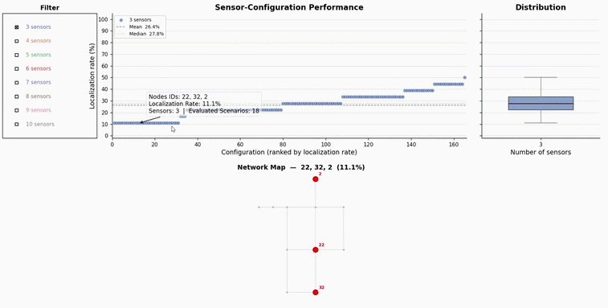

# Optimal Sensor Placement via Particle Swarm Optimisation

This repository contains scripts for finding optimal sensor placements in Water Distribution Networks (WDNs) using **Particle Swarm Optimisation (PSO)**. Given a set of candidate sensor locations, the pipeline evaluates every possible sensor combination by attempting to localise simulated leaks and measuring the localization accuracy.

## Overview

The approach works in three stages:

1. **Leak Scenario Generation** — Hydraulic simulations of leak events are pre-computed using [WNTR](https://wntr.readthedocs.io/) and stored as `.npz` archives.
2. **PSO-based Leak Localization** — For each candidate sensor configuration, a PSO optimizer ([Indago](https://pypi.org/project/Indago/)) minimises the mean-squared error between measured (pre-simulated) and PSO-generated pressure readings at the sensor nodes to locate the leak source.
3. **Result Aggregation & Visualization** — Results across all configurations are collected and visualized to identify the best-performing sensor placements.

## Network

The approach was originally developed and validated on **Net1**, the classic [EPANET tutorial network](https://github.com/USEPA/EPANET2/blob/master/User_Manual/Net1.inp). Net1 is a small benchmark with 11 nodes, 1 reservoir, 1 tank, and 1 pump — ideal for rapid prototyping and verifying the pipeline end-to-end.

The repository is currently configured to evaluate **`Network_1.inp`**, a larger water distribution network with:

- **128 junctions** (`JUNCTION-0` through `JUNCTION-128`, with some gaps)
- **1 reservoir** (`RESERVOIR-129`)
- **2 tanks** (`TANK-130`, `TANK-131`)
- **2 pumps** (`PUMP-170`, `PUMP-172`)
- **8 pressure-reducing valves** (`VALVE-173` through `VALVE-180`)

Both network files are included in the `networks/` directory. To switch back to Net1, update the `INP_FILE` path and the corresponding node lists/bounds in each script.

## File Descriptions

### `gen_leak_simulations.py`

Generates leak simulation scenarios for the water distribution network.

- Reads a WNTR `.inp` network file (e.g. `networks/Net1.inp` or `networks/Network_1.inp`).
- Iterates over all specified combinations of leak node, leak area, and discharge coefficient.
- For each combination, runs a full hydraulic simulation using WNTR's `WNTRSimulator` with Pressure Dependent Demand (PDD).
- For each demand pattern present in the `.inp` file, applies time-of-day, weekday/weekend, seasonal, and noise modifications before running the simulation.
- Saves pressure time-series for all nodes as a NumPy `.npz` archive containing:
  - `node_name_mapping` — dictionary mapping node IDs to integer indices.
  - `scenarios_params` — array of `[leak_node_index, leak_area, discharge_coeff]` per scenario.
  - `scenarios` — 3-D array of shape `(num_scenarios, num_nodes, num_timesteps)`.

**Key functions:**

| Function | Description |
|---|---|
| `modify_baseline_pattern()` | Applies time-of-day, weekday/weekend, seasonal, and noise multipliers to a base demand pattern. |
| `generate_single_simulation()` | Runs one leak simulation and returns the pressure matrix. |
| `generate_multiple_scenarios()` | Iterates over parameter combinations and saves all scenarios to disk. |

---

### `multi_scenario_eval.py`

Core evaluation module. For a given sensor configuration, it runs PSO to localise every pre-simulated leak scenario and records whether each leak was correctly located.

**How it works:**

1. Loads the pre-simulated leak scenarios from an `.npz` file.
2. For each scenario and random seed:
   - Sets up a PSO optimizer with 4 decision variables: `(eta_x, eta_y, std, h)` representing the leak location (x, y), Gaussian spread (`std`), and discharge coefficient height (`h`).
   - The **objective function** (`objective_function_mse`) simulates a leak at the candidate location and computes the MSE between the resulting pressures at the sensor nodes and the pre-simulated "measured" pressures.
   - PSO minimises this MSE to find the most likely leak source.
3. A leak is considered correctly located if the Euclidean distance between the predicted and actual leak coordinates is within a threshold radius (default: 10 units).
4. Results (per-scenario) are saved as CSV files.

**Key functions:**

| Function | Description |
|---|---|
| `generate_initial_candidates()` | Creates initial PSO particle positions from junction coordinates. |
| `generate_sample_simulation()` | Simulates a leak at a candidate location and returns sensor pressures. |
| `objective_function_mse()` | PSO objective — MSE between simulated and measured sensor pressures. |
| `custom_bivariate_gaussian_simplified()` | Computes Gaussian-shaped discharge coefficient based on distance to leak centre. |
| `euclidean_distance()` | Euclidean distance between two 2-D points. |
| `criteria()` | Success criterion — checks if predicted leak is within radius `r` of the true location. |
| `optimization_information()` | Packs optimization results into a dictionary for logging. |
| `main(process_id, sensor_config)` | Entry point: evaluates one sensor configuration across all scenarios. |

**PSO Parameters (configurable in `main`):**

| Parameter | Default | Description |
|---|---|---|
| `swarm_size` | `len(POSSIBLE_LEAK_JUNCTIONS)` | Number of particles in the swarm |
| `max_iterations` | 100 | Maximum PSO iterations |
| `max_evaluations` | 50 | Maximum objective function evaluations |
| `X0` | Junction coordinates | Initial particle positions |
| `lb` / `ub` | Network-dependent | Lower/upper bounds for `(x, y, std, h)` |

---

### `test_sensor_configurations.py`

Orchestrates the exhaustive evaluation of all sensor combinations using multiprocessing.

- Uses a defined subset of candidate sensor junctions (configurable in the script).
- For each target number of sensors, generates all possible \( C(n, k) \) combinations.
- Evaluates each combination in parallel using `multi_scenario_eval.main()`.
- Displays a progress bar via `tqdm`.

**Usage:**

```bash
python test_sensor_configurations.py
```

This will create results under `Network_1_evaluation/sensor_configurations/<num_sensors>/<hash>/combo_individual_results.csv`.

---

### `visualize_results.py`

Aggregates and visualizes the evaluation results.

- Walks the result directory tree and collects all per-combination CSV files.
- Groups results by sensor configuration and computes the **localization rate** (percentage of correctly located leaks).
- Displays an interactive scatter plot where each point is a sensor configuration. Hovering over a point reveals the sensor combination.

**Key functions:**

| Function | Description |
|---|---|
| `unify_sensor_combination_results()` | Merges CSV results for a single sensor count. |
| `unify_all_sensor_number_results()` | Merges results across all sensor counts. |
| `calculate_sensor_combination_metrics()` | Computes localization rate for a configuration. |

**Usage:**

```bash
python visualize_results.py
```

---

## Directory Structure

```
src_public/
├── README.md                       # This file
├── requirements.txt                # Python dependencies
├── gen_leak_simulations.py         # Step 1: Generate leak scenarios
├── multi_scenario_eval.py          # Step 2: PSO-based leak localization
├── test_sensor_configurations.py   # Step 2: Parallel evaluation of all sensor combos
└── visualize_results.py            # Step 3: Aggregate and visualize results
```

Expected data/network layout (created at runtime):

```
<working_directory>/
├── networks/
│   ├── Net1.inp                       # EPANET Net1 benchmark (original dev network)
│   └── Network_1.inp                  # Larger network (current configuration)
└── Network_1_evaluation/
    ├── scenarios/
    │   └── minimal_scenarios.npz      # Pre-simulated leak scenarios
    └── sensor_configurations/
        ├── 5/                         # Results for 5-sensor combinations
        ├── 10/                        # Results for 10-sensor combinations
        └── ...
```

## Installation

```bash
pip install -r requirements.txt
```

### Dependencies

| Package | Purpose |
|---|---|
| [wntr](https://wntr.readthedocs.io/) | Water network modelling and hydraulic simulation |
| [Indago](https://pypi.org/project/Indago/) | Particle Swarm Optimisation solver |
| [numpy](https://numpy.org/) | Numerical operations |
| [pandas](https://pandas.pydata.org/) | Tabular data handling |
| [matplotlib](https://matplotlib.org/) | Plotting |
| [mplcursors](https://mplcursors.readthedocs.io/) | Interactive plot annotations |
| [tqdm](https://tqdm.github.io/) | Progress bars |

## Quick Start

1. **Place your EPANET network file** in `networks/` (e.g. `Net1.inp` or `Network_1.inp`).

2. **Generate leak scenarios:**

   ```bash
   python gen_leak_simulations.py
   ```

   This creates `Network_1_evaluation/scenarios/minimal_scenarios.npz`.

3. **Evaluate all sensor configurations:**

   ```bash
   python test_sensor_configurations.py
   ```

   This runs PSO-based leak localization for every sensor combination and saves CSV results.

4. **Visualize results:**

   ```bash
   python visualize_results.py
   ```

   Opens an interactive scatter plot showing the localization rate of each sensor configuration.

## Demo

